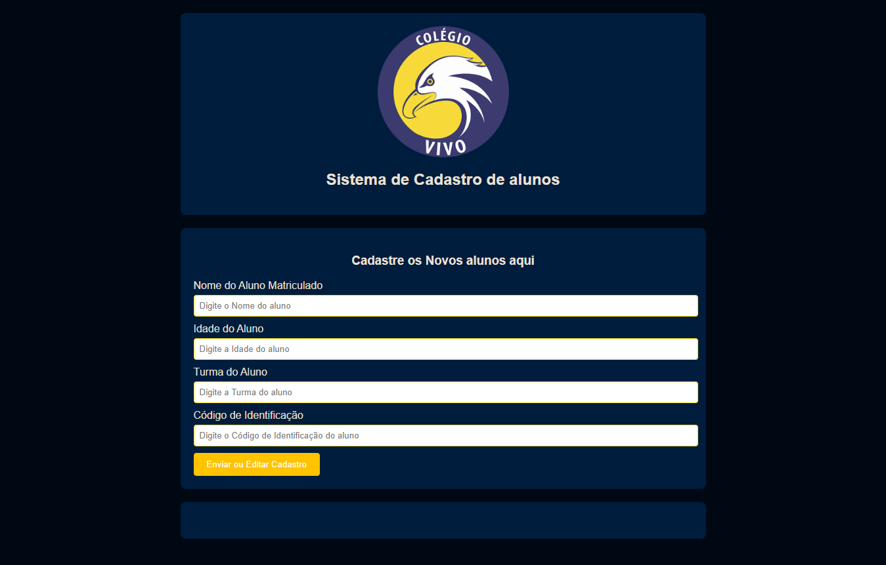
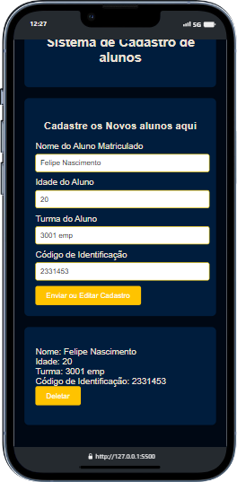

<h1>&#x1F680; Sistema de Cadastro de alunos. &#x1F680;</h1>

 
<h2>Descrição 	&#9997;</h2>

O Sistema de Cadastro de Alunos é uma aplicação web desenvolvida com HTML, CSS e JavaScript, que permite gerenciar informações de alunos de forma simples e intuitiva. Com este sistema, é possível adicionar novos alunos, editar informações existentes e excluir cadastros desnecessários. A interface amigável e a funcionalidade prática tornam este sistema uma solução eficiente para o gerenciamento de dados estudantis.

<h2>Como usar &#10067;</h2>
<ul>
<li> Utilize o botão de cadastro para adicionar um aluno ao sistema;</li>
<li> Utilize o codigo de identificação  no input para editar o cadastro do aluno desejado;</li>
<li> Com o botão deletar exclua as informações do aluno do sitema.</li>
</ul>

 

<h2>Tecnologias Usadas &#9881;</h2>
<ul>
<li> HTML;</li>
<li> CSS;</li>
<li> JavaScript.</li>
</ul>
<footer>

test 

</footer>